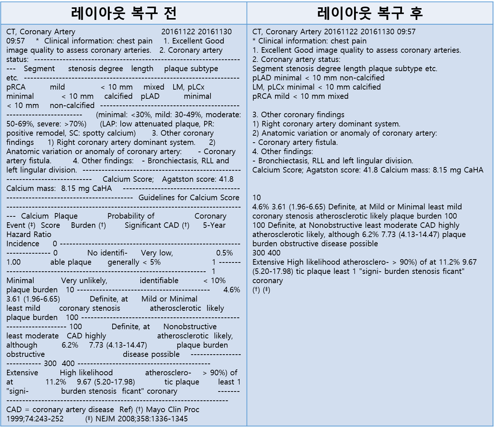

# PACS_4th

이 저장소의 모든 코드는 아산병원 심장 CT 영상판독문을 대상으로 python3 환경에서 개발되었습니다.
## 레이아웃 복구  
이 파일에는 영상판독문의 원본 레이아웃을 복구하고 불필요한 문장을 제거하는 부분이 포함되어 있습니다.  

###사용법  
<code>
python util_kaist_pacs.py -input_dir {입력 디렉토리} -output_dir {결과물 디렉토리}
</code>  

### 예시

 
## 지식 추출
지식 추출 모듈은 심장 CT 영상판독문에서 판독문의 기본정보와 심혈관의 상태 정보를 추출합니다.  
추출하는 판독문의 기본 정보로는 작성일, CT code, high risk plaque의 존재 유무가 있습니다.  
심혈관은 영상판독문에 나오는 것에 대해서 degree of stenosis, lesion length, plaque type을 추출하게 됩니다.

 

## 오류 감지