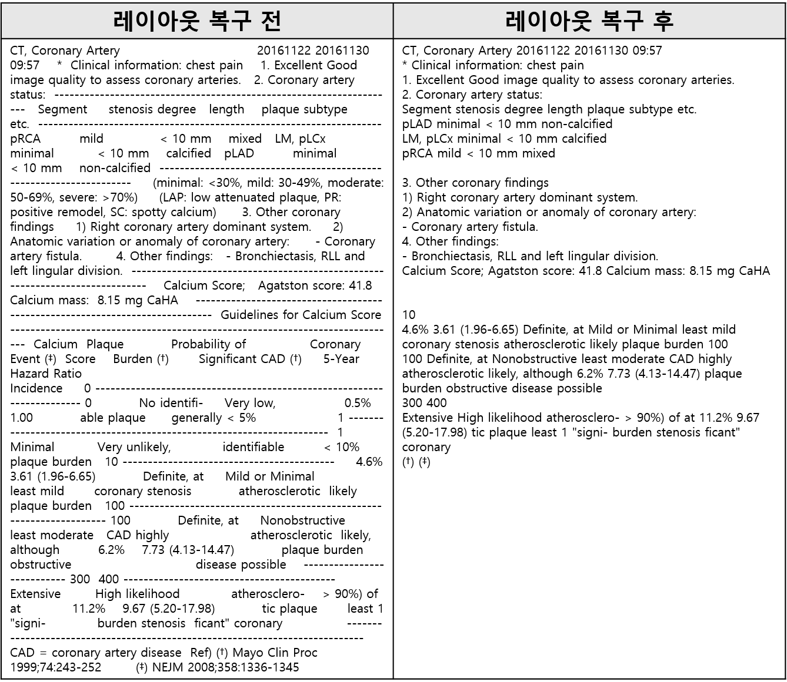
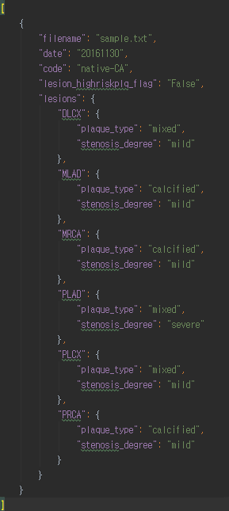

# PACS_4th

이 저장소의 모든 코드는 아산병원 심장 CT 영상판독문을 대상으로 python3 환경에서 개발되었습니다.
## 레이아웃 복구  
이 파일에는 영상판독문의 원본 레이아웃을 복구하고 불필요한 문장을 제거하는 부분이 포함되어 있습니다.  
레이아웃이 복구된 영상판독문은 지식 추출과 오류 감지 모듈에서 사용됩니다. 

### 사용법  
<code>python util_kaist_pacs.py -input_dir {입력 디렉토리} -output_dir {결과물 디렉토리}

예) python util_kaist_pacs.py -input_dir ./input -output_dir ./output
</code>  

### 예시

 
## 지식 추출
지식 추출 모듈은 심장 CT 영상판독문에서 판독문의 기본정보와 심혈관의 상태 정보를 추출합니다.  
추출하는 판독문의 기본 정보로는 작성일, CT code, 그리고 high risk plaque의 존재 유무가 있습니다.  
심혈관은 영상판독문에 기록된 것에 한해서 degree of stenosis, lesion length, plaque type을 추출하게 됩니다.

### 사용법  
<code>python KE.py -input_dir {입력 디렉토리} -output_path {추출 결과 파일 경로}

예) python KE.py -input_dir ./input -output_path ./output/sample.json
</code>  

### 결과물 예시

## 오류 감지
오류 감지 모듈은 심장 CT 영상 판독 결과를 문서로 전사하는 과정에서 발생하는 두 가지 오류를 감지합니다.  
첫 번째로는 오타 감지입니다. 전사과정에서 발생으로 예상되는 오타를 찾아냅니다.  
두 번째로는 이벤트의 선후 관계 확인입니다.
영상판독문에 나오는 날짜들의 선후관계를 확인하여 잘못된 경우에 이를 알려주는 역할을 합니다.   

### 사용법  
<code>python error_detection_v1.py -input_dir {입력 디렉토리} -output_dir {결과물 디렉토리} -error_type {typing/date/all 중 택1}</code>

예)  
오류 감지 폴더에서 input 폴더 안에 오타와 날짜 오류를 확인할 파일을 준비합니다.  
각각의 파일명은 typing_input.tsv, date_input.tsv로 정해져있습니다.  
각 파일은 이후 임의로 붙여진 id와 판독문 텍스트로 구성되어있으며, 자세한 것은 샘플로 넣어놓은 파일을 확인바랍니다.  
그 다음, cmd 창에  
<code>python error_detection_v1.py -input_dir ./input -output_dir ./output -error_type all</code>  
를 입력하여 프로그램을 실행합니다.
마지막으로 output 폴더 안의 각 파일에서 판독문마다 오류로 예상되는 단어, 날짜를 확인하실 수 있습니다.   

## Publisher
[Machine Reading Lab](http://mrlab.kaist.ac.kr/) @ KAIST
## Contact
Kuntae Kim. kuntaek@kaist.ac.kr
## Acknowledgement
This work was supported by the Industrial Strategic technology development program (10072064, Development of Novel Artificial Intelligence Technologies To Assist Imaging Diagnosis of Pulmonary, Hepatic, and Cardiac Diseases and Their Integration into Commercial Clinical PACS Platforms) funded by the Ministry of Trade Industry and Energy (MI, Korea)